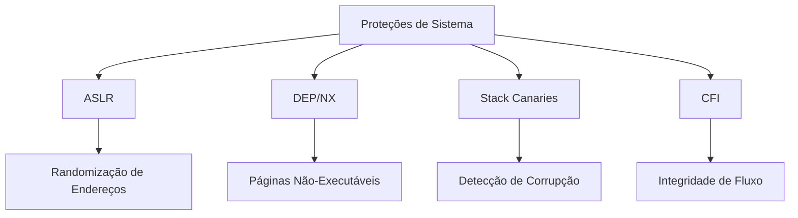

# Ameaças ao Programa

## Introdução

Os processos e o kernel são os únicos meios de realizar trabalho em um computador. Por isso, comprometer programas é um dos principais objetivos dos atacantes. Mesmo quando o ataque inicial não visa diretamente um programa, frequentemente o objetivo final é estabelecer uma presença maliciosa persistente através de programas comprometidos.

## Tipos de Ameaças

### 1. Malware Moderno

#### Ransomware
- Criptografa dados do usuário
- Exige pagamento para descriptografia
- Variantes como double-extortion que também vazam dados
- Ataques direcionados a empresas (Big Game Hunting)

#### Advanced Persistent Threats (APTs)
- Ataques sofisticados e persistentes
- Múltiplas técnicas de comprometimento
- Foco em alvos específicos
- Frequentemente patrocinados por estados

#### Fileless Malware
- Executa diretamente na memória
- Não deixa arquivos no disco
- Difícil detecção por antivírus tradicionais
- Usa ferramentas legítimas do sistema

### 2. Técnicas Clássicas Atualizadas

#### Cavalos de Troia Modernos
- Distribuídos via lojas de apps oficiais
- Disfarçados como apps legítimos
- Focados em roubo de dados bancários
- Exploram permissões do sistema

#### Supply Chain Attacks
- Comprometimento de dependências
- Injeção de código em bibliotecas populares
- Exploração de sistemas de build
- Ataques a repositórios de código

#### Living-off-the-Land Attacks
- Uso de ferramentas legítimas do sistema
- PowerShell e WMI no Windows
- Bash e Python no Linux
- Difícil distinção de uso legítimo

### 3. Vulnerabilidades de Memória

#### Buffer Overflow Moderno
- Bypass de proteções (DEP, ASLR)
- ROP (Return-Oriented Programming)
- Heap Spraying
- Use-After-Free

#### Ataques Side-Channel
- Spectre e Meltdown
- Rowhammer
- Cache timing attacks
- Vazamento de dados via canais laterais

## Medidas de Proteção

### 1. Proteções de Sistema

### 2. Práticas de Desenvolvimento

- Análise estática de código
- Fuzzing automatizado
- Code signing
- Sandboxing
- Memory safe languages

### 3. Monitoramento e Detecção

- EDR (Endpoint Detection and Response)
- XDR (Extended Detection and Response)
- Behavioral Analytics
- Machine Learning para detecção
- Threat Hunting proativo

## Tendências Futuras

1. **AI/ML em Ataques**
   - Malware adaptativo
   - Ataques automatizados
   - Deepfakes em engenharia social
   - Evasão de detecção via AI

2. **IoT e Dispositivos Embarcados**
   - Ataques a firmware
   - Comprometimento de supply chain
   - Botnets de IoT
   - Ataques físicos via dispositivos

3. **Cloud e Containers**
   - Container escape
   - Kubernetes attacks
   - Serverless exploitation
   - Cloud misconfiguration

## Recomendações de Segurança

1. **Defesa em Profundidade**
   - Múltiplas camadas de segurança
   - Princípio do menor privilégio
   - Segmentação de rede
   - Backup e recuperação

2. **Resposta a Incidentes**
   - Planos de contingência
   - Equipe de resposta
   - Análise forense
   - Lições aprendidas

3. **Treinamento e Conscientização**
   - Educação contínua
   - Simulações de ataque
   - Políticas de segurança
   - Cultura de segurança