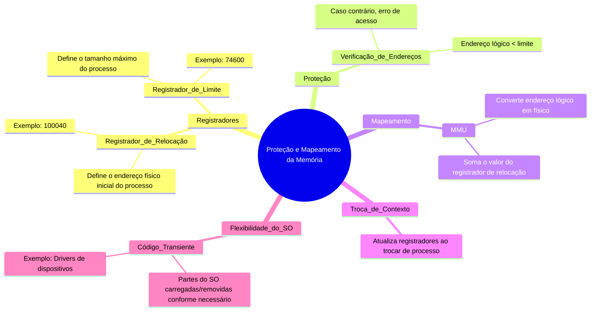

# Proteção e Mapeamento da Memória

Imagine que a memória do computador é como um prédio com vários apartamentos (processos). Para garantir que um morador (processo) não entre no apartamento errado ou cause problemas, precisamos de um **sistema de segurança** (proteção) e um **mapa** (mapeamento) que mostre onde cada morador pode ir. Isso é feito usando dois registradores especiais: o **registrador de relocação** e o **registrador de limite**.

## Como Funciona?
1. **Registrador de Relocação**:
   - Contém o endereço físico inicial onde o processo começa.
   - Exemplo: Se o valor for 100040, o processo começa nesse endereço.
2. **Registrador de Limite**:
   - Define o tamanho máximo que o processo pode ocupar.
   - Exemplo: Se o valor for 74600, o processo não pode acessar memória além de 100040 + 74600.
3. **Proteção**:
   - Cada endereço gerado pelo processo é verificado:
     - Se o endereço for maior que o limite, ocorre um erro (proteção contra acesso indevido).
     - Caso contrário, o endereço é mapeado somando o valor do registrador de relocação.
4. **Mapeamento**:
   - A **MMU** (Unidade de Gerenciamento de Memória) converte o endereço lógico (visto pelo processo) em um endereço físico (real na memória).

## Troca de Contexto
- Quando o sistema operacional troca de processo, ele atualiza os registradores de relocação e limite para os valores corretos do novo processo.
- Isso garante que cada processo só acesse sua própria área de memória.

## Flexibilidade do Sistema Operacional
- **Código Transiente**: Partes do sistema operacional (ex: drivers de dispositivos) podem ser carregadas e removidas da memória conforme necessário.
- Isso permite que o sistema operacional ajuste dinamicamente seu tamanho, liberando espaço para outros processos.

---

---

### Resumo
- **Registradores de Relocação e Limite**: Protegem e mapeiam a memória, garantindo que cada processo acesse apenas sua área.
- **Proteção**: Evita que processos acessem memória indevida.
- **Mapeamento**: Converte endereços lógicos em físicos.
- **Flexibilidade**: Permite que o sistema operacional ajuste seu tamanho dinamicamente.