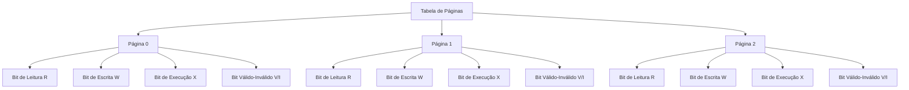
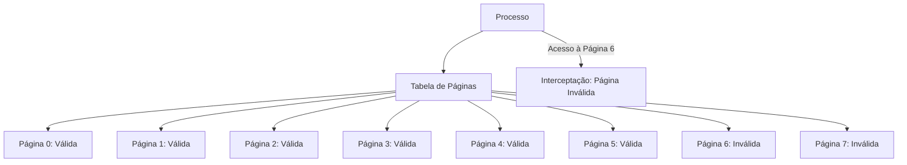

# Proteção em Sistemas Paginados

Em sistemas que utilizam paginação, a **proteção de memória** é essencial para garantir que processos não acessem ou modifiquem áreas de memória que não lhes pertencem. Isso é feito por meio de **bits de proteção** associados a cada entrada na tabela de páginas. Vamos explorar como isso funciona.

---

## 1. Bits de Proteção

Cada entrada na tabela de páginas contém **bits de proteção** que definem permissões de acesso para a página correspondente. Esses bits podem incluir:

- **Leitura (R)**: Permite apenas leitura da página.
- **Escrita (W)**: Permite leitura e escrita na página.
- **Execução (X)**: Permite a execução de código na página.

### Exemplo de Uso
- Se uma página estiver marcada como **somente leitura (R)**, qualquer tentativa de escrita nessa página causará uma **interceptação (trap)** do hardware, notificando o sistema operacional de uma violação de proteção.
- Páginas de código podem ser marcadas como **somente execução (X)**, impedindo que sejam modificadas ou lidas como dados.

---

## 2. Bit Válido-Inválido

Além dos bits de proteção, cada entrada na tabela de páginas possui um **bit válido-inválido**:

- **Válido (V)**: A página está no espaço de endereços lógicos do processo e pode ser acessada.
- **Inválido (I)**: A página não está no espaço de endereços lógicos do processo. Qualquer tentativa de acesso a uma página inválida causa uma **interceptação** (referência de página inválida).

### Exemplo Prático
- Suponha um processo com espaço de endereços de 14 bits (0 a 16383) e páginas de 2 KB.
- O processo usa apenas os endereços de 0 a 10468, ocupando as páginas 0 a 5.
- As páginas 6 e 7 são marcadas como **inválidas**, pois estão fora do espaço de endereços do processo.
- Qualquer tentativa de acessar as páginas 6 ou 7 resultará em uma interceptação.

---

## 3. Fragmentação Interna e Proteção

A paginação pode levar à **fragmentação interna**, onde parte de uma página fica inutilizada. Isso também afeta a proteção:

- No exemplo anterior, o processo usa apenas até o endereço 10468, mas a página 5 (que cobre até 12287) é marcada como **válida**.
- Isso significa que os endereços de 10469 a 12287 são **válidos**, mas não são usados pelo processo, resultando em fragmentação interna.

---

## 4. Registro de Extensão da Tabela de Páginas (PTLR)

Para evitar o desperdício de memória com tabelas de páginas grandes, alguns sistemas usam um **PTLR (Page Table Length Register)**:

- O PTLR indica o tamanho válido da tabela de páginas para um processo.
- Cada endereço lógico é comparado com o valor do PTLR. Se o endereço estiver fora do intervalo válido, uma **interceptação** é gerada.

### Vantagens
- Reduz o espaço ocupado pela tabela de páginas.
- Impede acessos a endereços fora do espaço de endereços do processo.

---

## 5. Diagramas

### Diagrama 1: Bits de Proteção na Tabela de Páginas

### Diagrama 2: Bit Válido-Inválido em Ação

---

## 6. Resumo

| Conceito                     | Descrição                                                                 |
|------------------------------|---------------------------------------------------------------------------|
| **Bits de Proteção**         | Controlam permissões de leitura, escrita e execução para cada página.     |
| **Bit Válido-Inválido**      | Indica se uma página está no espaço de endereços válido do processo.      |
| **Fragmentação Interna**     | Espaço não utilizado dentro de uma página válida.                         |
| **PTLR**                     | Registro que define o tamanho válido da tabela de páginas.                |
| **Interceptação**            | Notificação do hardware ao sistema operacional sobre violações de acesso. |

---

A proteção em sistemas paginados é garantida por **bits de proteção** e **bits válido-inválido** na tabela de páginas. Esses mecanismos impedem acessos ilegais e garantem que processos só possam acessar suas próprias áreas de memória. O uso de **PTLR** também ajuda a otimizar o uso da memória, evitando tabelas de páginas desnecessariamente grandes.