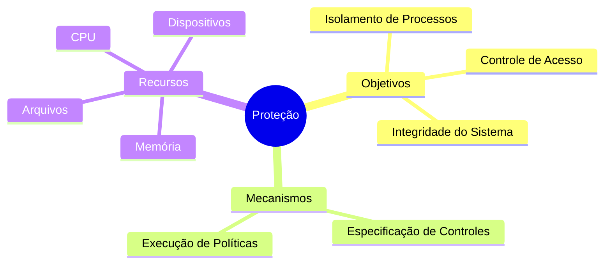
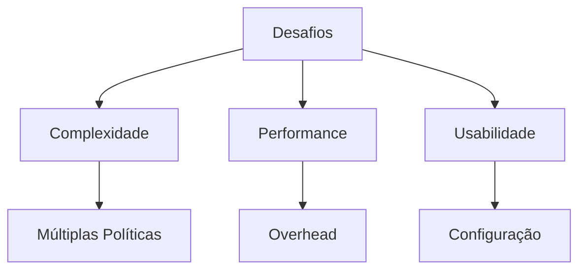

# Conceitos de Proteção

## Definição e Objetivos

A proteção em sistemas operacionais refere-se aos mecanismos que controlam o acesso de programas, processos ou usuários aos recursos do sistema computacional.

## Princípios Fundamentais

### 1. Isolamento
- Separação entre processos
- Proteção de recursos
- Prevenção de interferências

### 2. Controle de Acesso
- Definição de permissões
- Verificação de autorizações
- Gestão de privilégios

### 3. Mínimo Privilégio
- Acesso apenas ao necessário
- Redução de riscos
- Contenção de danos

## Mecanismos de Proteção

### Hardware
- Modo dual de operação
- Registradores de proteção
- MMU (Memory Management Unit)

### Software
- Sistemas de permissões
- Listas de controle de acesso
- Políticas de segurança

## Diferença entre Proteção e Segurança

| Característica | Proteção | Segurança |
|----------------|----------|-----------|
| Foco | Mecanismos internos | Ameaças externas |
| Escopo | Recursos específicos | Sistema completo |
| Implementação | Controles de acesso | Medidas defensivas |
| Objetivo | Isolamento | Integridade |

## Requisitos de Proteção

1. **Flexibilidade**
   - Políticas configuráveis
   - Adaptação a diferentes necessidades

2. **Eficiência**
   - Baixo overhead
   - Rápida verificação

3. **Facilidade de Uso**
   - Interface clara
   - Gerenciamento simplificado

## Desafios Comuns

## Considerações de Projeto

### 1. Granularidade
- Nível de objeto
- Nível de processo
- Nível de usuário

### 2. Domínios
- Definição clara
- Transições seguras
- Hierarquia

### 3. Revogação
- Imediata vs. adiada
- Seletiva vs. geral
- Temporária vs. permanente

## Resumo

- A proteção é fundamental para sistemas multiusuário
- Deve balancear segurança e usabilidade
- Requer mecanismos de hardware e software
- Implementação cuidadosa é essencial

## Próximos Passos

1. Estudo de domínios de proteção
2. Implementação de matriz de acesso
3. Sistemas baseados em capacidades
4. Proteção em linguagens de programação