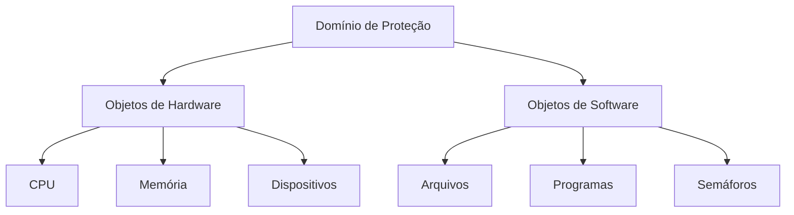
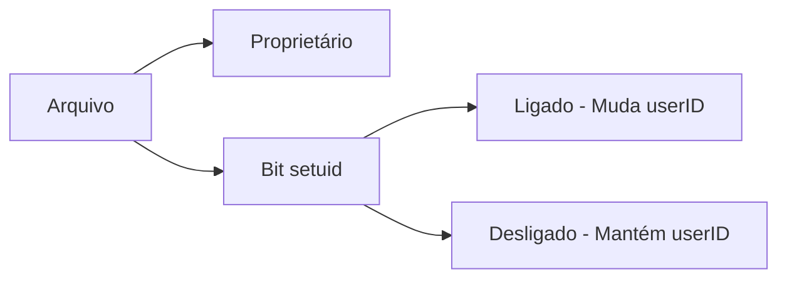
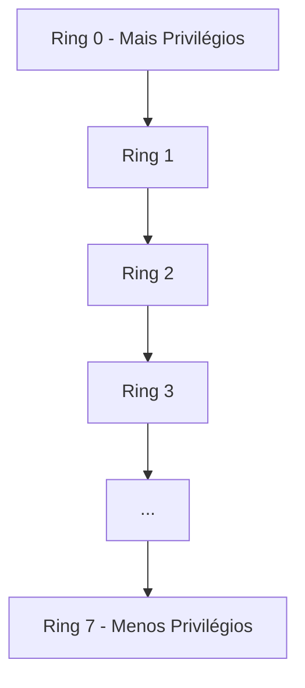

# Domínios de Proteção

## Conceito Fundamental

Um domínio de proteção define o conjunto de recursos e operações que um processo pode acessar e executar. Cada domínio especifica:
- Objetos acessíveis
- Operações permitidas sobre cada objeto
- Direitos de acesso

## Estrutura do Domínio

### Direitos de Acesso
- Par ordenado `<nome do objeto, conjunto de direitos>`
- Exemplo: `<arquivo F, {read, write}>`
- Define operações permitidas sobre cada objeto

### Características dos Domínios
1. **Compartilhamento**
   - Domínios podem compartilhar direitos
   - Sobreposição de permissões
   
2. **Associação**
   - Estática (fixa durante vida do processo)
   - Dinâmica (pode mudar durante execução)

## Implementações de Domínios

### 1. Por Usuário
- Domínio baseado na identidade do usuário
- Mudança ocorre na troca de usuário
- Exemplo: Login/Logout

### 2. Por Processo
- Domínio vinculado ao processo
- Mudança via comunicação entre processos
- Baseado em mensagens e respostas

### 3. Por Procedimento
- Domínio limitado ao escopo do procedimento
- Mudança ocorre em chamadas de procedimento
- Acesso restrito a variáveis locais

## Exemplos de Sistemas

### UNIX
- Domínios associados a usuários
- Uso do bit setuid para mudança temporária
- Identificação por userID

### MULTICS
- Organização hierárquica em anéis
- Numeração de 0 a 7
- Privilégios decrescentes do centro para fora

## Princípios de Proteção

### Princípio "Precisa Saber"
- Acesso apenas aos recursos necessários
- Minimização de danos potenciais
- Limitação de escopo

### Princípio do Menor Privilégio
- Direitos mínimos necessários
- Redução de riscos
- Contenção de falhas

## Considerações de Implementação

### Vantagens
- Isolamento efetivo
- Controle granular
- Flexibilidade de configuração

### Desafios
- Overhead de gerenciamento
- Complexidade de implementação
- Balanceamento entre segurança e usabilidade