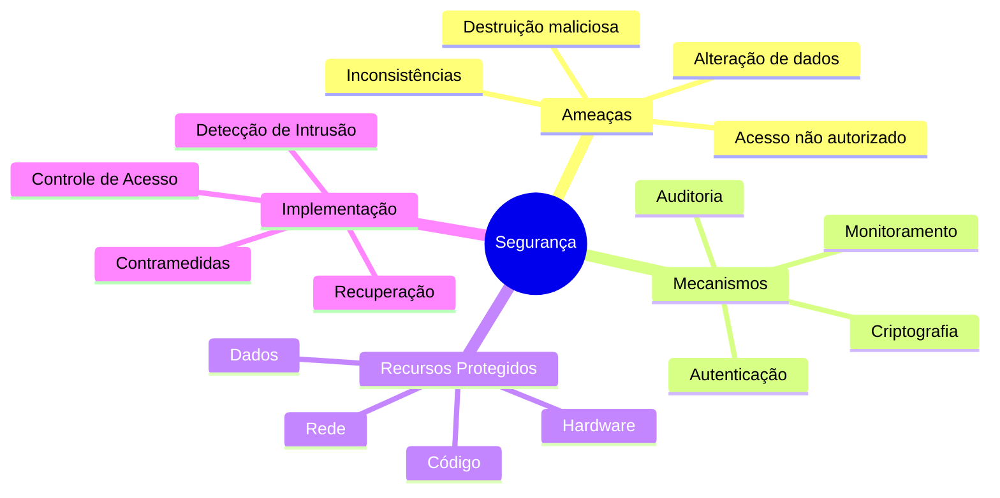
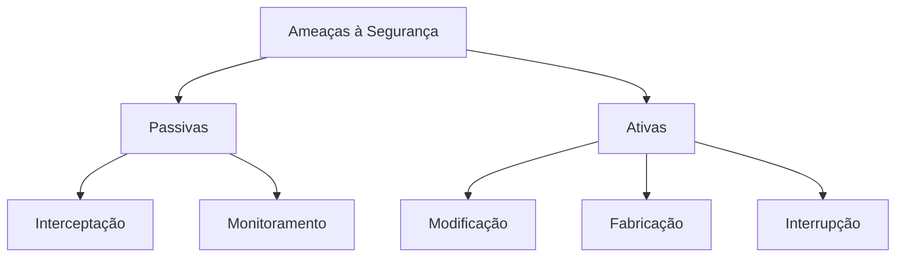

# Conceitos de Segurança

## Visão Geral

## Conceitos Fundamentais

### Definição
A segurança em sistemas computacionais é um conjunto abrangente de medidas que protege contra ameaças externas e internas, através de:
- Prevenção de acessos não autorizados
- Proteção contra modificações maliciosas
- Garantia de integridade dos dados

### Diferença entre Segurança e Proteção

| Aspecto | Segurança | Proteção |
|---------|-----------|----------|
| Foco | Defesa contra ameaças externas | Controle de acesso interno |
| Escopo | Sistema como um todo | Recursos do sistema |
| Objetivo | Integridade e confiabilidade | Isolamento e controle |
| Mecanismos | Criptografia, autenticação | Matriz de acesso, capacidades |

## Objetivos Principais

### 1. Confidencialidade
- Garantir privacidade dos dados
- Prevenir acesso não autorizado
- Proteger informações sensíveis

### 2. Integridade
- Prevenir modificações não autorizadas
- Detectar alterações maliciosas
- Manter consistência dos dados

### 3. Disponibilidade
- Garantir acesso aos recursos
- Prevenir negação de serviço
- Manter operação contínua

## Tipos de Ameaças

## Considerações de Implementação

1. **Autenticação**
   - Verificação de identidade
   - Múltiplos fatores
   - Biometria

2. **Criptografia**
   - Chaves simétricas
   - Chaves assimétricas
   - Funções hash

3. **Monitoramento**
   - Logs de sistema
   - Detecção de intrusão
   - Análise de comportamento

## Boas Práticas

1. **Princípio do Menor Privilégio**
   - Acesso mínimo necessário
   - Segregação de funções
   - Controle granular

2. **Defesa em Profundidade**
   - Múltiplas camadas de segurança
   - Redundância de controles
   - Diversidade de mecanismos

3. **Monitoramento Contínuo**
   - Auditoria regular
   - Análise de logs
   - Resposta a incidentes