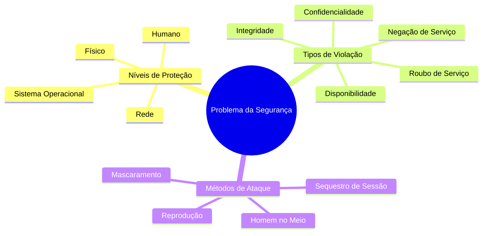
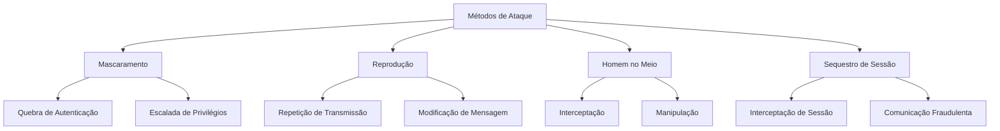
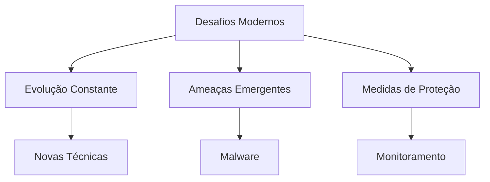

# O Problema da Segurança

```ascii
+----------------------+
|     SEGURANÇA       |
|   +--------------+  |
|   |  FIREWALL   |  |
|   |  ╔════════╗ |  |
|   |  ║ DADOS  ║ |  |
|   |  ╚════════╝ |  |
|   +--------------+  |
+----------------------+
```

## Visão Geral



## Desafios da Segurança

```ascii
Camadas de Segurança:
   ╔═══════════════╗
   ║   APLICAÇÃO   ║
   ╠═══════════════╣
   ║     REDE      ║
   ╠═══════════════╣
   ║      SO       ║
   ╠═══════════════╣
   ║   HARDWARE    ║
   ╚═══════════════╝
```

A segurança em sistemas computacionais apresenta diversos desafios:

1. **Alvos Valiosos**
   - Dados de folha de pagamento
   - Informações corporativas
   - Dados pessoais sensíveis

2. **Impossibilidade de Segurança Total**
   - Necessidade de minimizar violações
   - Balanceamento entre usabilidade e segurança
   - Proteção em múltiplas camadas

## Tipos de Violações de Segurança

```ascii
Tipos de Ataques:
    ┌─────────────┐
    │   Ataque    │
    └──────┬──────┘
           │
    ┌──────┴──────┐
    │  Proteção   │
    └──────┬──────┘
           │
    ┌──────┴──────┐
    │  Detecção   │
    └──────┬──────┘
           │
    ┌──────┴──────┐
    │ Recuperação │
    └─────────────┘
```

### 1. Quebra de Confidencialidade
- Leitura não autorizada de dados
- Roubo de informações
- Captura de dados sensíveis

### 2. Quebra de Integridade
- Modificação não autorizada
- Alteração de código-fonte
- Manipulação de dados

```ascii
Integridade de Dados:
    [Original] ---> [Hash] ---> [Verificação]
    A5F1B3..          ═══       A5F1B3..
                      ║X║       B4E2C1..
                      ═══       (Violação!)
```

### 3. Quebra de Disponibilidade
- Destruição de dados
- Vandalismo digital
- Modificação de sites

### 4. Roubo de Serviço
- Uso não autorizado de recursos
- Instalação de serviços maliciosos
- Apropriação de recursos

### 5. Negação de Serviço

```ascii
Ataque DoS:
    Usuários     Servidor
    Legítimos    ┌─────┐
    ╔═══╗  -->   │     │
    ║   ║        │  X  │ <-- Flood
    ╚═══╝        │     │    !!!!!!
                 └─────┘
```

## Métodos de Ataque



```ascii
Man-in-the-Middle:
    A -----> M -----> B
    ^               ^
    |               |
    +---- Evil -----+
```

## Níveis de Proteção

```ascii
Níveis de Proteção:
    ┌───────────────────┐
    │    Aplicação      │
    ├───────────────────┤
    │      Rede         │
    ├───────────────────┤
    │       SO          │
    ├───────────────────┤
    │    Hardware       │
    └───────────────────┘
```

### 1. Nível Físico
- Proteção das instalações
- Controle de acesso físico
- Segurança de hardware

### 2. Nível Humano
- Autorização cuidadosa
- Prevenção contra engenharia social
- Treinamento e conscientização

### 3. Nível do Sistema Operacional
- Proteção contra brechas
- Controle de processos
- Gerenciamento de privilégios

### 4. Nível de Rede
- Proteção de dados em trânsito
- Segurança das comunicações
- Prevenção contra interceptação

```ascii
Firewall:
    Internet
       ║
    ╔══╩══╗
    ║ FW  ║
    ╚══╦══╝
       ║
    Intranet
```

## Desafios Modernos



1. **Evolução Constante**
   - Novas técnicas de ataque
   - Contramedidas em desenvolvimento
   - Necessidade de atualização contínua

2. **Ameaças Emergentes**
   - Spyware
   - Canais de spam
   - Ataques sofisticados

```ascii
Evolução das Ameaças:
    2000 ─── Vírus
    2005 ─── Worms
    2010 ─── Ransomware
    2015 ─── IoT Attacks
    2020 ─── AI Threats
    2023 ─── ???
```

3. **Medidas de Proteção**
   - Hardware especializado
   - Recursos de proteção
   - Monitoramento contínuo