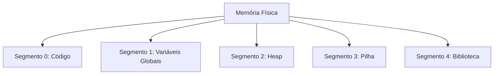
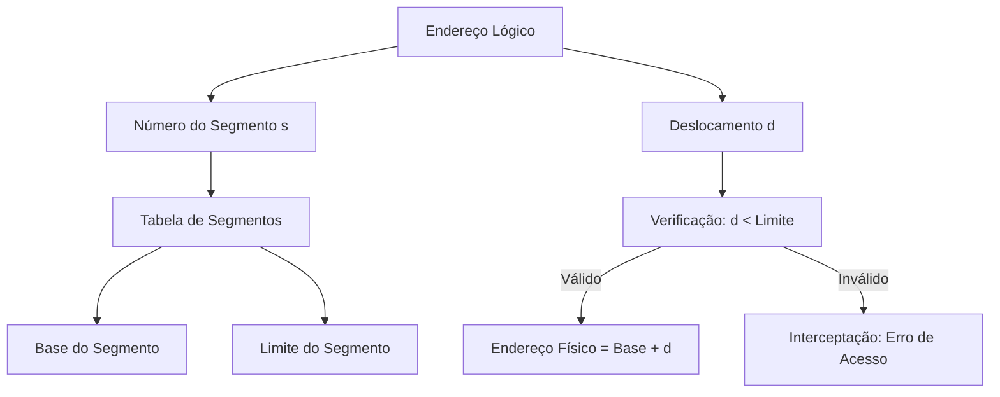

# 6.7 Segmentação

A **segmentação** é um esquema de gerenciamento de memória que reflete a forma como os usuários (programadores) enxergam a memória: como uma coleção de **segmentos de tamanho variável**, cada um com um propósito específico (por exemplo, código, dados, pilha, etc.). Diferente da paginação, que divide a memória em páginas de tamanho fixo, a segmentação permite que os segmentos tenham tamanhos diferentes, o que se alinha melhor com a estrutura lógica de um programa.

---

## 1. Método Básico

### Visão do Usuário
- Os usuários (programadores) não pensam na memória como um array linear de bytes.
- Em vez disso, eles veem a memória como uma coleção de **segmentos**:
  - **Código**: Instruções do programa.
  - **Dados**: Variáveis globais, estruturas de dados.
  - **Pilha**: Usada para chamadas de função e armazenamento temporário.
  - **Heap**: Memória alocada dinamicamente.
- Cada segmento tem um **nome** e um **tamanho variável**.

### Endereçamento Lógico
- Um endereço lógico na segmentação é representado por um **par ordenado**:
  - **Número do Segmento (s)**: Identifica o segmento.
  - **Deslocamento (d)**: Posição dentro do segmento.
- Exemplo: `<s=2, d=100>` refere-se ao byte 100 do segmento 2.

---

## 2. Hardware de Segmentação

Para implementar a segmentação, o hardware usa uma **tabela de segmentos**.

### Tabela de Segmentos {id="tabela-de-segmentos_1"}
- Cada entrada na tabela de segmentos contém:
  - **Base**: Endereço físico inicial do segmento.
  - **Limite**: Tamanho do segmento.
- O número do segmento (**s**) é usado como índice na tabela de segmentos.
- O deslocamento (**d**) deve estar dentro do limite do segmento. Caso contrário, ocorre uma **interceptação** (erro de acesso à memória).

### Tradução de Endereço
1. O número do segmento (**s**) é usado para indexar a tabela de segmentos.
2. O hardware verifica se o deslocamento (**d**) é menor que o limite do segmento.
   - Se for válido, o endereço físico é calculado como: **base + d**.
   - Se for inválido, ocorre uma interceptação.

### Exemplo
- **Segmento 2**:
  - Base: 4300.
  - Limite: 400.
- **Endereço Lógico**: `<s=2, d=53>`.
- **Endereço Físico**: \(4300 + 53 = 4353\).

---

## 3. Vantagens da Segmentação

1. **Alinhamento com a Visão do Programador**:
   - Reflete a estrutura lógica do programa (código, dados, pilha, etc.).
   - Facilita o desenvolvimento e a depuração.

2. **Proteção**:
   - Cada segmento pode ter permissões de acesso diferentes (leitura, escrita, execução).
   - Acesso a segmentos inválidos é detectado pelo hardware.

3. **Compartilhamento de Segmentos**:
   - Segmentos podem ser compartilhados entre processos (por exemplo, bibliotecas compartilhadas).

---

## 4. Desafios da Segmentação

1. **Fragmentação Externa**:
   - Como os segmentos têm tamanhos variáveis, a memória pode ficar fragmentada, com pequenos espaços livres entre segmentos.
   - Isso pode dificultar a alocação de novos segmentos.

2. **Gerenciamento Complexo**:
   - Alocar e desalocar segmentos de tamanhos variáveis é mais complexo do que gerenciar páginas de tamanho fixo.

3. **Desempenho**:
   - A tradução de endereços é mais lenta do que na paginação, pois envolve consultas à tabela de segmentos e verificações de limites.

---

## 5. Exemplo Prático

### Programa em C
Um programa em C pode ser dividido nos seguintes segmentos:
1. **Código**: Instruções do programa.
2. **Variáveis Globais**: Dados compartilhados.
3. **Heap**: Memória alocada dinamicamente.
4. **Pilha**: Usada para chamadas de função.
5. **Biblioteca Padrão**: Funções da biblioteca C.

### Tabela de Segmentos
| Número do Segmento | Base  | Limite |
|---------------------|-------|--------|
| 0 (Código)          | 2000  | 1000   |
| 1 (Variáveis Globais)| 3000  | 500    |
| 2 (Heap)            | 3500  | 800    |
| 3 (Pilha)           | 4300  | 400    |
| 4 (Biblioteca)      | 4700  | 600    |

### Tradução de Endereços
- **Endereço Lógico**: `<s=0, d=100>` → Endereço Físico: \(2000 + 100 = 2100\).
- **Endereço Lógico**: `<s=3, d=852>` → **Erro**: O segmento 3 tem limite 400.

---

## 6. Comparação com Paginação

| Característica               | Paginação                     | Segmentação                   |
|------------------------------|-------------------------------|-------------------------------|
| **Tamanho das Unidades**     | Páginas de tamanho fixo.      | Segmentos de tamanho variável.|
| **Visão do Programador**     | Linear (array de bytes).      | Lógica (código, dados, pilha).|
| **Fragmentação**             | Fragmentação interna.         | Fragmentação externa.         |
| **Proteção**                 | Por página.                   | Por segmento.                 |
| **Desempenho**               | Mais rápido (tabelas simples).| Mais lento (verificação de limites). |

---

## 7. Diagramas

### Diagrama 1: Segmentação da Memória

### Diagrama 2: Tradução de Endereço

---

A **segmentação** é uma técnica de gerenciamento de memória que reflete a visão lógica do programador, dividindo a memória em segmentos de tamanho variável. Embora ofereça vantagens como alinhamento com a estrutura do programa e proteção, ela também apresenta desafios, como fragmentação externa e complexidade de gerenciamento. A escolha entre segmentação e paginação depende das necessidades do sistema e da aplicação.