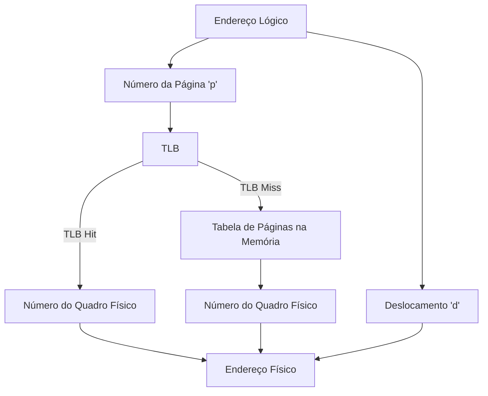
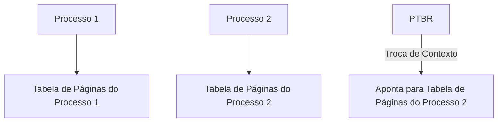

# Suporte do Hardware para Paginação

A paginação é uma técnica poderosa para gerenciar memória, mas seu sucesso depende do **hardware** que a implementa. Vamos explorar como o hardware suporta a paginação, incluindo o uso de **tabelas de páginas**, **TLB (Translation Look-aside Buffer)** e **registradores especiais**.

---

## 1. Tabelas de Páginas e Registradores

### Tabela de Páginas
- Cada processo tem sua própria **tabela de páginas**, que mapeia páginas lógicas para quadros físicos.
- A tabela de páginas é armazenada na **memória principal**.
- Um **registrador especial**, chamado **PTBR (Page Table Base Register)**, aponta para o início da tabela de páginas do processo em execução.

### Troca de Contexto
- Quando o sistema operacional troca de processo, ele atualiza o **PTBR** para apontar para a tabela de páginas do novo processo.
- Isso é feito pelo **despachante** (scheduler), que também recarrega outros registradores, como o **contador de instrução**.

### Desafio: Acesso à Memória
- Para acessar um endereço físico, o hardware precisa:
  1. Consultar a tabela de páginas (usando o PTBR).
  2. Obter o número do quadro físico.
  3. Combinar o quadro físico com o deslocamento para formar o endereço físico.
- Isso resulta em **dois acessos à memória** (um para a tabela de páginas e outro para o dado), o que pode ser lento.

---

## 2. TLB (Translation Look-aside Buffer)

Para acelerar o processo de tradução de endereços, o hardware usa um **cache especial** chamado **TLB**.

### O que é a TLB?
- A TLB é uma **memória associativa de alta velocidade** que armazena entradas recentes da tabela de páginas.
- Cada entrada na TLB contém:
  - **Chave (Tag)**: Número da página.
  - **Valor**: Número do quadro físico correspondente.

### Funcionamento da TLB
1. Quando a CPU gera um endereço lógico, o número da página é enviado à TLB.
2. Se a página estiver na TLB (**TLB hit**), o número do quadro é retornado imediatamente.
3. Se a página não estiver na TLB (**TLB miss**), o hardware consulta a tabela de páginas na memória principal e atualiza a TLB com a nova entrada.

### Vantagens da TLB
- Reduz o tempo de tradução de endereços.
- A maioria dos acessos à memória é resolvida pela TLB, evitando consultas à tabela de páginas na memória principal.

### Taxa de Acertos (Hit Rate)
- A **taxa de acertos** é a porcentagem de vezes que a TLB encontra o número da página.
- Exemplo:
  - Taxa de acertos de 80%: 80% dos acessos são resolvidos pela TLB.
  - Taxa de acertos de 98%: 98% dos acessos são resolvidos pela TLB.

### Cálculo do Tempo Efetivo de Acesso
- **TLB Hit**: 20 ns (pesquisa na TLB) + 100 ns (acesso à memória) = 120 ns.
- **TLB Miss**: 20 ns (pesquisa na TLB) + 100 ns (acesso à tabela de páginas) + 100 ns (acesso à memória) = 220 ns.
- **Tempo Efetivo**:
  - Para taxa de acertos de 80%: \(0,80 \times 120 + 0,20 \times 220 = 140\) ns.
  - Para taxa de acertos de 98%: \(0,98 \times 120 + 0,02 \times 220 = 122\) ns.

---

## 3. ASID (Address Space Identifier)

Para evitar conflitos entre processos, a TLB pode usar **ASIDs**.

### O que é o ASID?
- Um **ASID** é um identificador único para cada processo.
- Cada entrada na TLB contém um ASID, que garante que as traduções de endereços sejam válidas apenas para o processo correto.

### Vantagens do ASID
- Permite que a TLB armazene entradas de vários processos simultaneamente.
- Evita a necessidade de esvaziar a TLB a cada troca de contexto.

---

## 4. Diagramas

### Diagrama 1: Funcionamento da TLB

### Diagrama 2: Troca de Contexto com PTBR

---

## 5. Resumo

| Conceito               | Descrição                                                                 |
|------------------------|---------------------------------------------------------------------------|
| **Tabela de Páginas**  | Mapeia páginas lógicas para quadros físicos. Armazenada na memória principal. |
| **PTBR**               | Registrador que aponta para a tabela de páginas do processo em execução.   |
| **TLB**                | Cache de alta velocidade para entradas da tabela de páginas.               |
| **TLB Hit**            | Número da página encontrado na TLB. Tradução rápida.                       |
| **TLB Miss**           | Número da página não encontrado na TLB. Requer acesso à tabela de páginas. |
| **ASID**               | Identificador único para cada processo, evitando conflitos na TLB.         |

---

## Conclusão
O suporte de hardware para paginação, especialmente com o uso de **TLB** e **ASID**, é essencial para garantir eficiência e desempenho. A TLB reduz significativamente o tempo de tradução de endereços, enquanto o ASID permite que múltiplos processos compartilhem a TLB sem conflitos.