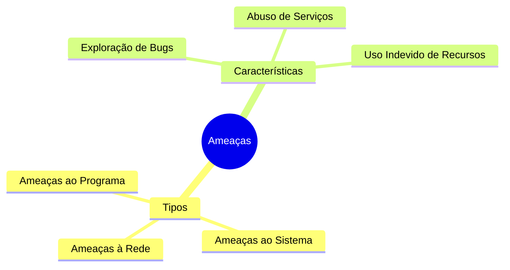
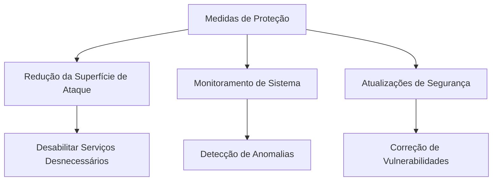

# Ameaças ao Sistema e à Rede

## Visão Geral



## Principais Tipos de Ameaças

### 1. Vermes (Worms)

- Processo que se auto-replica
- Usa recursos do sistema
- Pode se propagar pela rede
- Exemplo histórico: Verme Morris (1988)
  - Atacou sistemas UNIX na Internet
  - Explorou falhas em:
    - finger
    - sendmail
    - rsh

### 2. Varredura de Porta (Port Scanning)

- Método de detecção de vulnerabilidades
- Características:
  - Automatizado
  - Tenta conexões TCP/IP
  - Identifica serviços vulneráveis
- Ferramentas comuns:
  - nmap
  - Nessus

### 3. Negação de Serviço (DoS)

```ascii
Ataque DoS:
    Usuários     Servidor
    Legítimos    ┌─────┐
    ╔═══╗  -->   │     │
    ║   ║        │  X  │ <-- Flood
    ╚═══╝        │     │    !!!!!!
                 └─────┘
```

#### Categorias:
1. Consumo de Recursos
   - Esgotamento de CPU
   - Esgotamento de memória
   - Janelas pop-up infinitas

2. Interrupção de Rede
   - Abuso de protocolos TCP/IP
   - Sessões TCP parciais
   - DDoS (Distributed Denial of Service)

## Medidas de Proteção



### Recomendações:
1. Manter serviços desabilitados por padrão
2. Implementar autenticação robusta
3. Monitorar atividades suspeitas
4. Manter sistemas atualizados
5. Implementar firewalls e controles de acesso