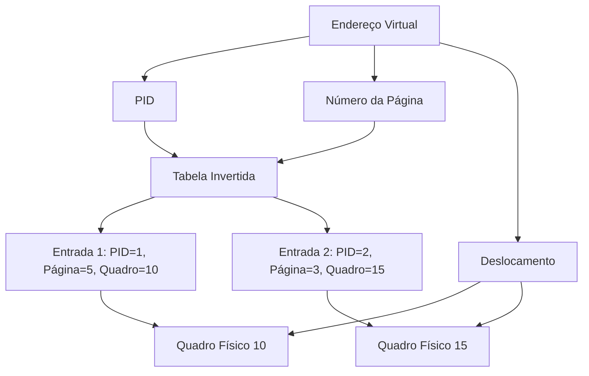
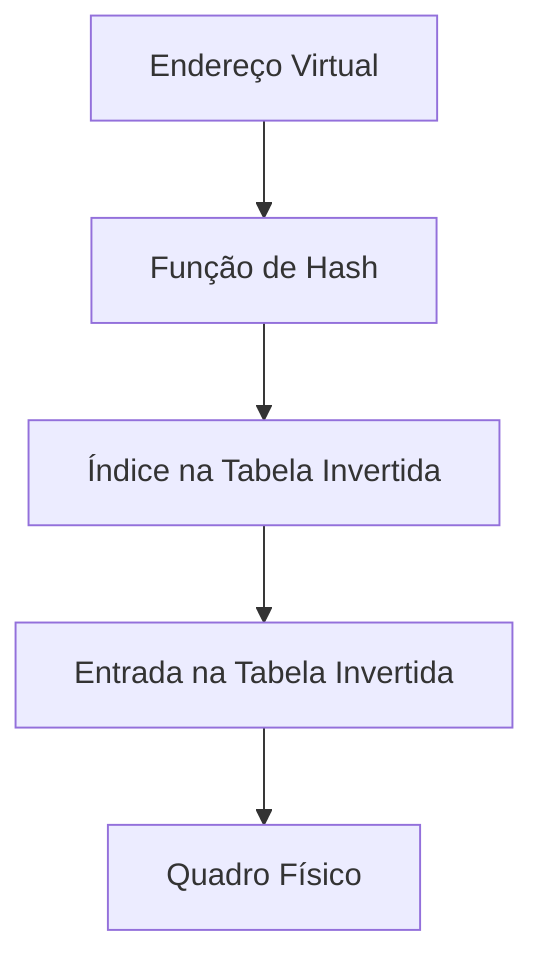

# Tabelas de Página Invertidas

As **tabelas de página invertidas** são uma abordagem alternativa para gerenciar tabelas de páginas em sistemas com grandes espaços de endereçamento. Diferente das tabelas de página tradicionais, que possuem uma entrada para cada página virtual, as tabelas invertidas possuem uma entrada para cada **quadro físico** da memória. Isso reduz drasticamente o tamanho da tabela de páginas, mas introduz desafios em termos de desempenho e implementação.

---

## 1. O que é uma Tabela de Página Invertida?

- **Tabela Tradicional**: Cada processo tem sua própria tabela de páginas, com uma entrada para cada página virtual.
- **Tabela Invertida**: Há apenas **uma tabela de páginas para todo o sistema**, com uma entrada para cada quadro físico da memória.

### Estrutura da Tabela Invertida
Cada entrada na tabela invertida contém:
- **Identificador do Processo (PID)**: Identifica o processo que está usando a página.
- **Número da Página Virtual**: Identifica a página lógica associada ao quadro físico.
- **Outras Informações**: Bits de proteção, bits válido-inválido, etc.

---

## 2. Como Funciona?

### Tradução de Endereço
1. O endereço virtual é dividido em:
   - **PID**: Identificador do processo.
   - **Número da Página Virtual**: Identifica a página lógica.
   - **Deslocamento**: Posição dentro da página.
2. A tabela invertida é pesquisada para encontrar uma entrada que corresponda ao **<PID, Número da Página Virtual>**.
3. Se a entrada for encontrada, o **número do quadro físico** é combinado com o deslocamento para formar o endereço físico.
4. Se a entrada não for encontrada, ocorre uma **falha de página** (acesso ilegal).

### Exemplo
- Endereço Virtual: `<PID=1, Número da Página=5, Deslocamento=100>`.
- Tabela Invertida:
  - Entrada 1: `<PID=1, Número da Página=5, Quadro Físico=10>`.
  - Entrada 2: `<PID=2, Número da Página=3, Quadro Físico=15>`.
- Resultado: Endereço Físico = `<Quadro Físico=10, Deslocamento=100>`.

---

## 3. Vantagens

1. **Economia de Memória**:
   - A tabela invertida tem apenas uma entrada por quadro físico, em vez de uma entrada por página virtual.
   - Reduz o espaço ocupado pela tabela de páginas, especialmente em sistemas com muitos processos.

2. **Simplicidade**:
   - Há apenas uma tabela de páginas para todo o sistema, simplificando o gerenciamento.

---

## 4. Desafios

1. **Tempo de Pesquisa**:
   - A tabela invertida precisa ser pesquisada para cada referência à memória.
   - Isso pode ser lento, especialmente em sistemas com muita memória física.

2. **Memória Compartilhada**:
   - Em tabelas invertidas, uma página física só pode ser mapeada para um único endereço virtual.
   - Isso dificulta a implementação de **memória compartilhada**, onde múltiplos processos precisam mapear a mesma página física.

---

## 5. Soluções para Melhorar o Desempenho

### Tabela Hash
- Uma **tabela hash** é usada para acelerar a pesquisa na tabela invertida.
- O endereço virtual (PID + Número da Página) é passado para uma função de hash, que retorna um índice na tabela invertida.
- Isso reduz o número de entradas que precisam ser pesquisadas.

### TLB (Translation Lookaside Buffer)
- A TLB é usada para armazenar entradas recentes da tabela invertida.
- Se o endereço virtual estiver na TLB, a tradução é feita rapidamente, sem consultar a tabela invertida.

---

## 6. Exemplo de Uso

### IBM RT
- O sistema IBM RT usa tabelas de página invertidas.
- Cada endereço virtual é uma tripla: `<PID, Número da Página, Deslocamento>`.
- A tabela invertida é pesquisada para encontrar uma correspondência com `<PID, Número da Página>`.

### UltraSPARC e PowerPC
- Essas arquiteturas também utilizam tabelas de página invertidas.
- Elas armazenam um **identificador de espaço de endereço (ASID)** em cada entrada para garantir que as páginas de diferentes processos não entrem em conflito.

---

## 7. Comparação com Tabelas de Página Tradicionais

| Característica               | Tabela Tradicional               | Tabela Invertida                 |
|------------------------------|----------------------------------|----------------------------------|
| **Tamanho da Tabela**        | Grande (uma entrada por página virtual). | Pequeno (uma entrada por quadro físico). |
| **Complexidade**             | Mais complexa (uma tabela por processo). | Mais simples (uma tabela para todo o sistema). |
| **Desempenho**               | Mais rápido (acesso direto à tabela). | Mais lento (pesquisa necessária). |
| **Memória Compartilhada**    | Fácil de implementar.            | Difícil de implementar.          |

---

## 8. Diagramas

### Diagrama 1: Tabela de Página Invertida

### Diagrama 2: Uso de Tabela Hash

---

## Conclusão
As **tabelas de página invertidas** são uma solução eficiente em termos de espaço para gerenciar tabelas de páginas em sistemas com grandes espaços de endereçamento. No entanto, elas introduzem desafios em termos de desempenho e implementação de memória compartilhada. O uso de **tabelas hash** e **TLB** ajuda a mitigar esses problemas, tornando as tabelas invertidas uma opção viável para sistemas modernos.