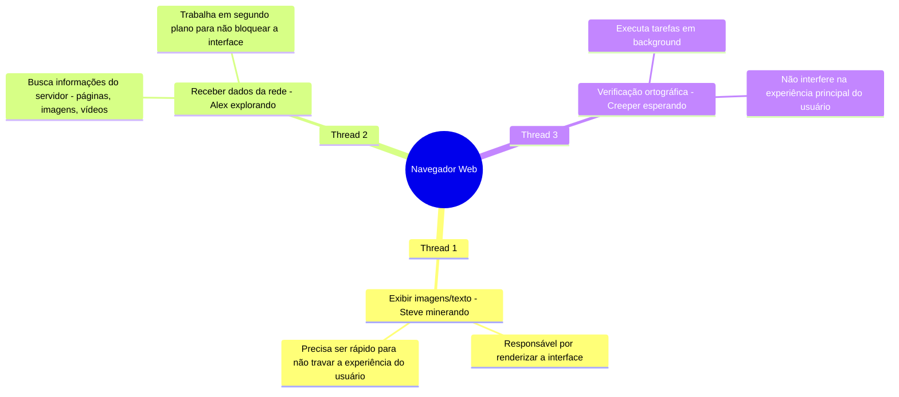
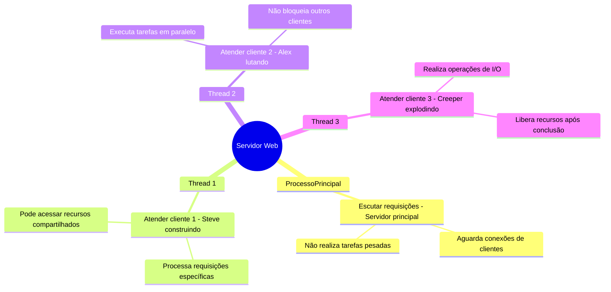
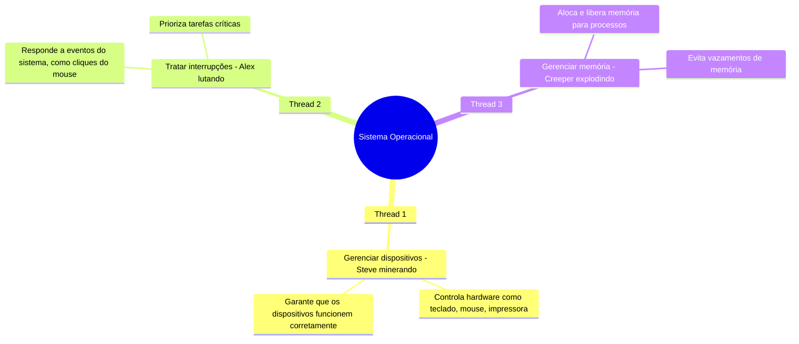

# 4.1. Usos

## Contextualização: O que são Threads e Por Que São Importantes?

Em computação, um **processo** é um programa em execução, como um navegador Web, um jogo ou um servidor. Tradicionalmente, um processo tinha apenas uma **thread de controle**, ou seja, uma única sequência de execução de instruções. Isso significa que, em um processo single-threaded, todas as tarefas são executadas de forma sequencial, uma após a outra. Por exemplo, se você estivesse rodando um navegador Web single-threaded, ele não poderia carregar uma página enquanto responde aos cliques do mouse ou verifica a ortografia de um texto.

No entanto, com o avanço da tecnologia e a necessidade de maior eficiência e desempenho, os sistemas operacionais modernos passaram a suportar **processos multithreaded**, ou seja, processos que contêm múltiplas threads de controle. Uma **thread** é uma unidade básica de execução dentro de um processo, capaz de realizar tarefas de forma independente. Isso permite que um processo execute várias operações simultaneamente, melhorando a utilização de recursos e a responsividade das aplicações.

## **Por Que Threads São Importantes?**
1. **Concorrência**: Threads permitem que várias tarefas sejam executadas ao mesmo tempo, como carregar uma página Web enquanto o usuário digita ou ouve música.
2. **Eficiência**: Threads são mais leves que processos, pois compartilham recursos como memória e arquivos abertos. Isso reduz a sobrecarga do sistema.
3. **Responsividade**: Aplicações multithreaded são mais ágeis, pois tarefas demoradas podem ser executadas em segundo plano sem travar a interface do usuário.
4. **Escalabilidade**: Servidores e sistemas operacionais podem atender a milhares de requisições simultaneamente, criando uma thread para cada tarefa.

Agora que entendemos o que são threads e por que elas são importantes, vamos explorar exemplos práticos usando **Minecraft** como analogia para ilustrar como as threads são usadas em diferentes contextos.

---

### **1. Navegador Web (Minecraft como analogia)**

**Explicação Detalhada:**
- Um navegador Web moderno é como um **Minecraft com múltiplos personagens**. Cada thread (personagem) tem uma função específica:
  - **Thread 1 (Steve minerando)**: Responsável por exibir imagens e texto na tela. Precisa ser rápido para garantir que a interface do usuário não trave.
  - **Thread 2 (Alex explorando)**: Busca dados da rede, como páginas, imagens e vídeos. Trabalha em segundo plano para que o usuário possa continuar interagindo com a interface.
  - **Thread 3 (Creeper esperando)**: Realiza tarefas em background, como verificação ortográfica. Não interfere na experiência principal do usuário.

**Benefícios:**
- **Concorrência**: As threads permitem que o navegador execute várias tarefas ao mesmo tempo, como carregar uma página enquanto o usuário digita.
- **Responsividade**: A interface do usuário não trava, pois as tarefas demoradas são executadas em segundo plano.
- **Eficiência**: Recursos do sistema são utilizados de forma otimizada.

---

### **2. Servidor Web (Minecraft Servidor)**

**Explicação Detalhada:**
- Um servidor Web é como um **servidor de Minecraft** que precisa atender a vários jogadores (clientes) ao mesmo tempo:
  - **Processo Principal**: Escuta requisições de clientes, mas não realiza tarefas pesadas. É como o servidor principal que aguarda conexões.
  - **Thread 1 (Steve construindo)**: Atende a um cliente específico, processando suas requisições. Pode acessar recursos compartilhados, como bancos de dados.
  - **Thread 2 (Alex lutando)**: Atende outro cliente em paralelo, sem bloquear os demais.
  - **Thread 3 (Creeper explodindo)**: Realiza operações de I/O, como leitura/escrita de arquivos, e libera recursos após concluir a tarefa.

**Benefícios:**
- **Escalabilidade**: O servidor pode atender a milhares de clientes simultaneamente, criando uma thread para cada requisição.
- **Eficiência**: Threads são mais leves que processos, economizando recursos do sistema.
- **Concorrência**: Várias requisições são processadas ao mesmo tempo, sem que os clientes precisem esperar.

---

### **3. Sistema Operacional Multithread**

**Explicação Detalhada:**
- O sistema operacional é como um **Minecraft com mods**, onde cada thread (personagem) tem uma função específica:
  - **Thread 1 (Steve minerando)**: Gerencia dispositivos de hardware, como teclado, mouse e impressora. Garante que todos os dispositivos funcionem corretamente.
  - **Thread 2 (Alex lutando)**: Trata interrupções do sistema, como cliques do mouse ou pressionamentos de tecla. Prioriza tarefas críticas para manter o sistema responsivo.
  - **Thread 3 (Creeper explodindo)**: Gerencia a memória do sistema, alocando e liberando memória para processos. Evita vazamentos de memória, que podem travar o sistema.

**Benefícios:**
- **Modularidade**: Cada thread é responsável por uma tarefa específica, facilitando a manutenção e o desenvolvimento do sistema operacional.
- **Eficiência**: Tarefas críticas, como o gerenciamento de memória, são executadas de forma independente, sem interferir no funcionamento geral do sistema.
- **Concorrência**: Várias tarefas do sistema são executadas simultaneamente, garantindo que o computador funcione de forma suave e responsiva.

---

## Conclusão Geral

Threads são como **personagens em Minecraft**: cada um pode realizar tarefas independentes, tornando o sistema mais eficiente, responsivo e escalável. Sem threads, seria como jogar Minecraft com apenas um personagem fazendo tudo de forma lenta e sequencial. Aqui estão os principais pontos:

1. **Concorrência**: Threads permitem que várias tarefas sejam executadas ao mesmo tempo, como minerar, construir e lutar em Minecraft.
2. **Eficiência**: Threads são mais leves que processos, economizando recursos do sistema.
3. **Responsividade**: A interface do usuário não trava, pois tarefas demoradas são executadas em segundo plano.
4. **Escalabilidade**: Sistemas multithread podem atender a milhares de requisições simultaneamente, como um servidor Web ou um servidor de Minecraft.

