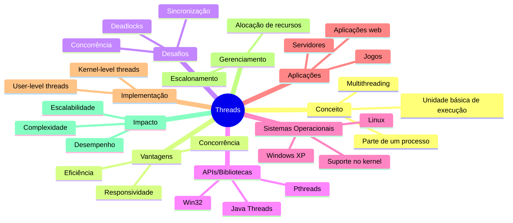

# Threads

No contexto da computação moderna, o conceito de processos foi tradicionalmente associado à execução de um programa com uma única linha de execução, ou *thread*. No entanto, com o avanço das tecnologias e a necessidade de maior eficiência e desempenho, os sistemas operacionais evoluíram para suportar processos com múltiplas threads de controle. Este capítulo explora o conceito de *threads*, que são unidades fundamentais de execução dentro de um processo, permitindo que tarefas sejam realizadas de forma concorrente e paralela.

A introdução de threads trouxe uma nova dimensão ao design de sistemas operacionais e à programação de aplicações. Ao permitir que um processo contenha várias threads, os sistemas podem executar múltiplas tarefas simultaneamente, melhorando a utilização de recursos e a responsividade das aplicações. Este capítulo aborda os principais conceitos relacionados a sistemas *multithreaded*, incluindo as APIs mais comuns para manipulação de threads, como Pthreads, Win32 e as bibliotecas de threads em Java.

Além disso, serão examinadas as questões e desafios associados à programação multithread, como sincronização, concorrência e escalonamento, e como esses aspectos influenciam o design dos sistemas operacionais. Por fim, será explorado o suporte a threads no nível do kernel em sistemas operacionais modernos, como Windows XP e Linux, destacando como esses sistemas gerenciam e otimizam a execução de múltiplas threads.

**Objetivos do Capítulo**

- Introduzir o conceito de thread como uma unidade fundamental de execução.
- Explorar as APIs e bibliotecas para manipulação de threads em diferentes ambientes.
- Discutir os desafios e técnicas de programação multithread.
- Analisar o impacto das threads no design dos sistemas operacionais.
- Examinar o suporte a threads no nível do kernel em sistemas operacionais modernos.

