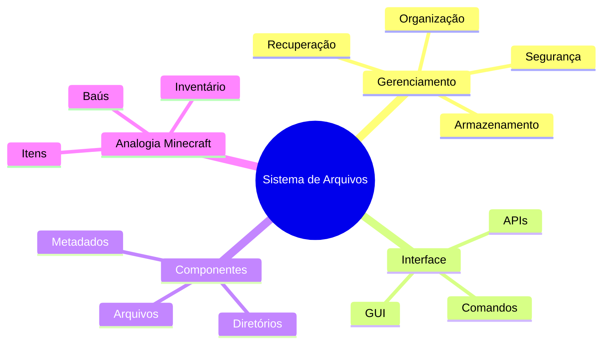

# 7 Gerenciamento de Armazenamento

O **sistema de arquivos** é como o inventário do Minecraft para o sistema operacional. Assim como você organiza seus itens, blocos e ferramentas no jogo, o sistema de arquivos organiza e gerencia arquivos, diretórios, programas e informações dos usuários no computador.

Para entender melhor, imagine o sistema de arquivos como um baú gigante no Minecraft, cheio de compartimentos organizados. Cada compartimento representa um arquivo ou diretório, e o sistema operacional precisa de uma maneira eficiente de acessar e gerenciar esses compartimentos.

Assim como no Minecraft você precisa de uma interface para interagir com seu inventário, o sistema operacional necessita de uma **interface do sistema de arquivos**. Esta interface permite que programas e usuários acessem e manipulem arquivos de forma fácil e segura.

Portanto, para os sistemas operacionais, dois aspectos são cruciais:
1. O **gerenciamento dos arquivos**: como organizar e manter os arquivos (similar a como você organiza seus itens em baús diferentes no Minecraft).
2. A **interface do sistema de arquivos**: como permitir o acesso e manipulação desses arquivos (semelhante à interface de inventário que você usa no jogo).

