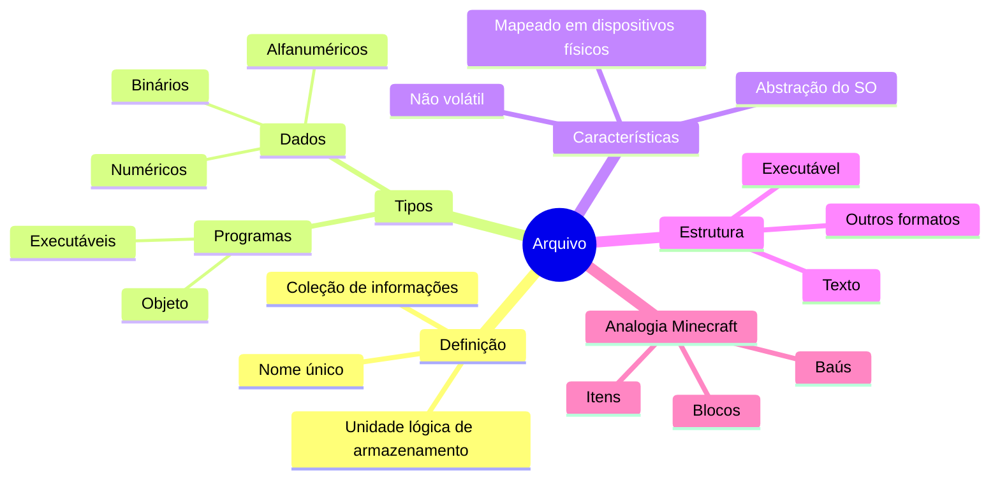

# 7.1 Arquivos: Os Blocos Fundamentais do Sistema Operacional

Imagine o seu computador como um mundo de Minecraft. Os arquivos são como os blocos básicos que compõem esse mundo. Assim como no Minecraft você interage com blocos sem se preocupar com a complexidade por trás deles, o sistema operacional (SO) permite que você trabalhe com arquivos sem precisar entender os detalhes técnicos do armazenamento físico.

## O que é um Arquivo?

Um arquivo é como um baú no Minecraft: uma coleção de informações com um nome único. Assim como um baú pode conter itens variados, um arquivo pode armazenar diferentes tipos de dados.

- O SO "esconde" a complexidade do armazenamento físico (como os mecanismos internos de um baú estão ocultos no Minecraft).
- Os arquivos são mapeados em dispositivos físicos não voláteis (HD, SSD), assim como os baús são colocados em blocos sólidos no mundo do Minecraft.
- Para um usuário, um arquivo é a menor unidade de armazenamento, assim como um slot de inventário é a menor unidade de armazenamento no Minecraft.

> Pense nisso: quase tudo no seu computador é um arquivo, exceto as pastas (que são como as estruturas que agrupam baús no Minecraft).

## Tipos de Arquivos

No Minecraft, você tem diferentes tipos de itens (ferramentas, blocos, comida). De forma similar, os arquivos podem ser de diferentes tipos:

1. **Arquivos de Programa**
   - **Executáveis**: Como uma ferramenta pronta para uso no Minecraft.
   - **Objeto**: Como os componentes para criar uma ferramenta (ainda não montados).

2. **Arquivos de Dados**
   - **Numéricos**: Como contadores de itens no Minecraft.
   - **Alfanuméricos**: Como nomes de itens ou placas de texto.
   - **Binários**: Como os dados internos que o jogo usa para funcionar.

Arquivos podem ser simples (como um bloco de terra) ou complexos (como um mecanismo de redstone).

> Um arquivo é uma sequência de bits, bytes ou linhas, assim como um item no Minecraft é composto por pixels ou voxels.

## Estrutura dos Arquivos

Diferentes arquivos têm estruturas diferentes, assim como diferentes blocos no Minecraft têm propriedades únicas:

- **Arquivos de Texto**: Uma sequência de caracteres, como um livro no Minecraft.
- **Arquivos Executáveis**: Contêm instruções, como um bloco de comando no Minecraft.

