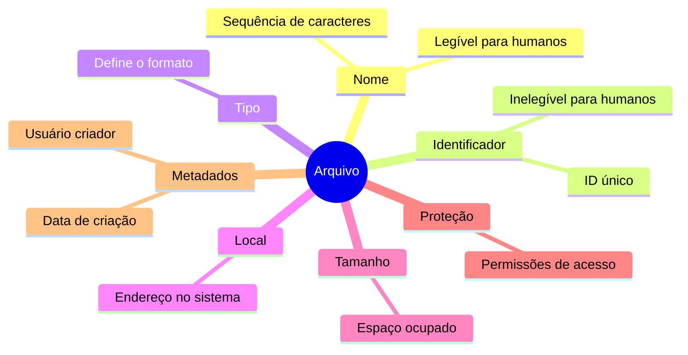

# 7.1.1 Atributos de Arquivos

Imagine os arquivos como itens no seu inventário do Minecraft. Cada item tem características únicas, assim como cada arquivo em um sistema operacional tem seus próprios atributos.

## Nome do Arquivo
Assim como você nomeia seus itens no Minecraft para encontrá-los facilmente, um arquivo é referenciado por um **nome** para comodidade humana e manutenção da integridade do sistema.

- Os **nomes de arquivos** são como etiquetas em baús do Minecraft:
  - Geralmente são uma **sequência de caracteres**
  - Alguns caracteres especiais não são permitidos (como você não pode usar certos símbolos para nomear itens no Minecraft)
  - **Exemplo**: `diamante.txt` (como nomear um baú "Diamantes" no Minecraft)

## Independência dos Arquivos
Os arquivos são como blocos colocados no mundo do Minecraft:

- Permanecem mesmo após você sair do jogo (o arquivo `diamante.txt` existe mesmo que o processo que o criou seja encerrado)
- Continuam existindo mesmo se você mudar de versão do Minecraft (o arquivo permanece mesmo que o sistema operacional mude)
- Mantêm-se inalterados mesmo se outro jogador entrar no mundo (o arquivo permanece o mesmo, mesmo que o usuário mude)

> Os atributos dos arquivos podem variar entre sistemas, assim como diferentes mods do Minecraft podem adicionar novas propriedades aos itens.

## Atributos Principais
Pense nos atributos como as propriedades de um item no Minecraft:

- **Nome**: A etiqueta visível do item (legível para humanos)
- **Identificador**: O ID único do item no código do jogo (inelegível para humanos)
- **Tipo**: Define se é uma ferramenta, bloco, comida, etc. (ajuda o sistema a lidar com o arquivo)
- **Local**: As coordenadas do bloco no mundo (ponteiro para o endereço do arquivo)
- **Tamanho**: Quantos slots do inventário ocupa (quantidade de bytes ou blocos)
- **Proteção**: Configurações de quem pode usar o item (permissões de leitura, escrita, execução)
- **Metadados**: Informações extras como encantamentos (hora, data e identificação do usuário)

Todas essas informações são armazenadas em estruturas similares aos baús do Minecraft (diretórios) no disco rígido (o "mundo" do sistema operacional).

## Fluxo de Acesso
Quando você abre um baú no Minecraft, primeiro vê o nome, depois os itens são carregados. De forma similar, o sistema operacional usa o nome e o identificador do arquivo para buscar os outros atributos, carregando as informações conforme necessário.

