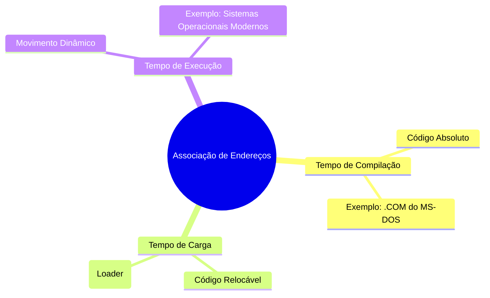

# Associação de Endereços

Imagine que você está jogando **Minecraft**. Seu mundo é como a **memória do computador**, e os **processos** são como **construções** que você cria. Para construir algo, você precisa de **blocos** (dados e instruções) que estão armazenados no seu **inventário** (disco). Para começar a construir, você precisa **trazer os blocos do inventário para o mundo** (memória). Esse processo de mover blocos entre o inventário e o mundo é semelhante à **associação de endereços** na memória.

## Diagrama 1: Processo de Construção no Minecraft
```
Inventário (Disco) → Mundo (Memória) → Construção (Processo)
```

## Etapas de Associação de Endereços
1. **Tempo de Compilação (Compile Time)**:
   - É como planejar uma construção no Minecraft antes de começar. Você já sabe exatamente onde cada bloco vai ficar no mundo.
   - Se o local inicial mudar, você precisa **replanejar tudo** (recompilar o código).
   - **Exemplo no Minecraft**: Você decide construir uma casa em uma coordenada específica (X=100, Y=64, Z=200). Se mudar de ideia e quiser construir em outro lugar, terá que refazer o plano.

2. **Tempo de Carga (Load Time)**:
   - Aqui, você sabe que vai construir algo, mas ainda não decidiu o local exato. Você só escolhe o local quando começa a colocar os blocos no mundo.
   - **Exemplo no Minecraft**: Você tem um projeto de casa, mas só decide onde construí-la quando começa a jogar. Se mudar de local, basta **recarregar** o projeto no novo local.

3. **Tempo de Execução (Runtime)**:
   - Nesse caso, você pode **mover a construção** para outro lugar enquanto joga. Isso requer um "poder especial" (hardware adicional) para garantir que tudo funcione corretamente.
   - **Exemplo no Minecraft**: Você constrói uma casa e, depois de um tempo, decide movê-la para outro bioma. O jogo precisa ajustar automaticamente as coordenadas dos blocos para que a casa continue intacta.

## Diagrama 2: Associação de Endereços
```
Tempo de Compilação → Tempo de Carga → Tempo de Execução
```

---



A **associação de endereços** é como organizar e mover construções no Minecraft. Dependendo do momento em que você decide onde colocar os blocos (dados e instruções), o processo pode ser mais ou menos flexível. No **tempo de compilação**, tudo é fixo; no **tempo de carga**, você escolhe o local ao carregar; e no **tempo de execução**, você pode mover as construções livremente, mas isso requer suporte especial (hardware). Cada método tem suas vantagens e é usado em diferentes cenários, dependendo das necessidades do sistema. 🎮