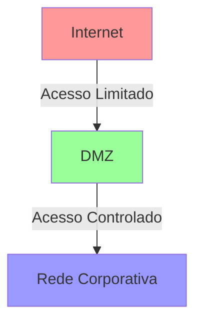

# Firewalls: Protegendo Sistemas e Redes

## Conceito Básico

```ascii
    INTERNET          FIREWALL           REDE INTERNA
      [WWW]    <----> [===||===]  <---->  [PC][PC][PC]
    (Perigo)         (Proteção)          (Zona Segura)
```

Um firewall é um dispositivo (computador, aparelho ou roteador) que atua como barreira de segurança entre redes confiáveis e não confiáveis. Sua função principal é controlar e monitorar o tráfego de rede entre diferentes domínios de segurança.

## Funcionalidades Principais

```ascii
╔══════════════════════╗
║    FIREWALL RULES    ║
╠══════════════════════╣
║ → Allow  HTTP:80     ║
║ → Allow  HTTPS:443   ║
║ → Allow  DNS:53      ║
║ → Block  TELNET:23   ║
║ → Block  FTP:21      ║
╚══════════════════════╝
```

- Limitação de acesso entre domínios
- Monitoramento de conexões
- Registro de atividades
- Filtragem baseada em:
  - Endereço de origem/destino
  - Porta de origem/destino
  - Direção da conexão

## Arquitetura DMZ

```ascii
┌─────────────┐    ┌──────────┐    ┌──────────────┐
│  INTERNET   │◄──►│   DMZ    │◄──►│ REDE INTERNA │
│ (Não Segura)│    │(Semi-Seg)│    │   (Segura)   │
└─────────────┘    └──────────┘    └──────────────┘
      ▲                 ▲                 ▲
      │                 │                 │
   Externos         Servidores        Usuários
                     Web/Mail         Corporativos
```



### Características da DMZ
- Zona intermediária (semissegura)
- Separa Internet da rede interna
- Hospeda serviços públicos (ex: servidores web)
- Controle granular de acessos

## Tipos de Firewalls

```ascii
┌────────────────────────────────────┐
│         TIPOS DE FIREWALL          │
├────────────┬────────────┬─────────┤
│   REDE     │  PESSOAL   │  PROXY  │
│ [═══||═══] │  [🖥️ ]    │  [↔️ ]  │
└────────────┴────────────┴─────────┘
```

### 1. Firewall de Rede
```ascii
   [Internet] ═══> [FIREWALL] ═══> [LAN]
     └─ Tráfego Filtrado ─┘
```
- Mais comum
- Protege domínios de segurança
- Controla tráfego entre redes

### 2. Firewall Pessoal
```ascii
┌──────────────┐
│    APP 1     │
├──────────────┤
│ FIREWALL OS  │
├──────────────┤
│  HARDWARE    │
└──────────────┘
```
- Instalado no sistema operacional
- Protege host específico
- Controla comunicações individuais

### 3. Firewall de Proxy de Aplicação
```ascii
Cliente ──> [PROXY] ──> Servidor
           ┌─────┐
           │Check│
           └─────┘
```
- Entende protocolos específicos
- Analisa tráfego em nível de aplicação
- Filtra comandos maliciosos

### 4. Firewall XML
```ascii
╔════════════════════╗
║ <xml>             ║
║   CHECK SYNTAX    ║
║   VALIDATE SCHEMA ║
║ </xml>            ║
╚════════════════════╝
```
- Específico para tráfego XML
- Analisa estrutura e conteúdo
- Bloqueia XML malformado

### 5. Firewall de Chamada de Sistema
```ascii
┌─────────────┐
│ Aplicação   │
├─────────────┤
│ Syscall FW  │──> [✓] Permitido
├─────────────┤    [✗] Bloqueado
│ Kernel      │
└─────────────┘
```
- Monitora chamadas do sistema
- Implementa princípio do menor privilégio
- Controla ações dos processos

## Limitações e Vulnerabilidades

```ascii
⚠️ ATENÇÕES E RISCOS ⚠️
┌────────────────────────┐
│ ▶ Ataques via Túnel   │
│ ▶ DoS Attacks         │
│ ▶ IP Spoofing         │
│ ▶ Protocol Exploits   │
└────────────────────────┘
```

### Pontos Fracos
1. Não impede ataques via túnel
2. Vulnerável a ataques de negação de serviço
3. Suscetível a spoofing de IP
4. Não bloqueia ataques em protocolos permitidos

### Recomendações de Segurança
```ascii
🛡️ BEST PRACTICES 🛡️
┌────────────────────┐
│ 1. Protect FW     │
│ 2. Multiple Layers│
│ 3. Update Rules   │
│ 4. Monitor Logs   │
└────────────────────┘
```
- Proteger o próprio firewall
- Implementar múltiplas camadas de defesa
- Manter regras atualizadas
- Monitorar logs regularmente