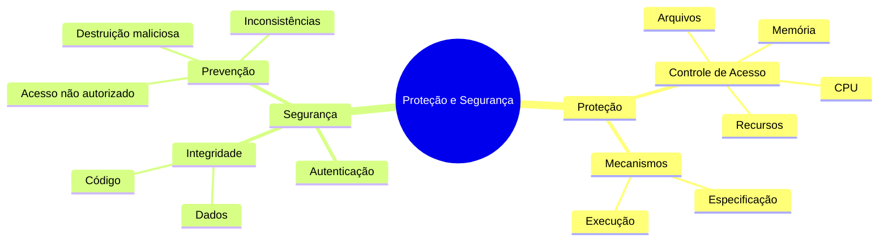
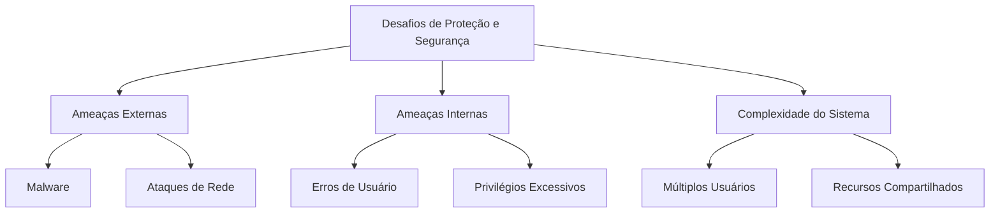

# Introdução à Proteção e Segurança

## Visão Geral

## Conceitos Fundamentais

### 🛡️ Proteção
A proteção em sistemas operacionais funciona como um sistema de controle de acesso em um prédio:

- **Definição**: Mecanismo que controla o acesso de programas, processos ou usuários aos recursos do sistema
- **Objetivo**: Garantir que apenas processos autorizados acessem recursos específicos
- **Componentes**:
  - Mecanismos de controle
  - Políticas de acesso
  - Verificação de permissões

### 🔒 Segurança
A segurança atua como um sistema de vigilância completo:

- **Definição**: Conjunto de medidas para proteger a integridade do sistema e seus dados
- **Objetivo**: Prevenir acessos não autorizados e proteger recursos do sistema
- **Aspectos**:
  - Autenticação de usuários
  - Proteção de dados
  - Prevenção contra ataques

## Analogia Prática: Minecraft

Imagine um servidor Minecraft para entender proteção e segurança:

| Conceito | Minecraft | Sistema Operacional |
|----------|-----------|---------------------|
| Proteção | Permissões de blocos | Controle de acesso a recursos |
| Autenticação | Login do jogador | Autenticação de usuário |
| Recursos Protegidos | Baús com trava | Arquivos protegidos |
| Áreas Restritas | Claim de terreno | Espaço de memória protegido |

## Importância

1. **Isolamento**
   - Separação entre processos
   - Proteção de recursos críticos
   - Prevenção de interferências

2. **Confiabilidade**
   - Integridade dos dados
   - Estabilidade do sistema
   - Recuperação de falhas

3. **Privacidade**
   - Confidencialidade
   - Controle de acesso
   - Proteção de dados sensíveis

## Desafios Modernos

## Mecanismos Básicos

### 1. Controle de Acesso
- Matriz de acesso
- Listas de controle de acesso (ACL)
- Capabilities

### 2. Autenticação
- Senhas
- Tokens
- Biometria

### 3. Autorização
- Níveis de privilégio
- Permissões granulares
- Políticas de acesso

## Próximos Tópicos

- Mecanismos de Proteção
- Gerenciamento de Usuários
- Criptografia
- Políticas de Segurança
- Detecção de Intrusão
- Recuperação de Desastres

## Exercícios Práticos

1. **Análise de Permissões**
   - Examine as permissões de arquivos
   - Identifique vulnerabilidades
   - Proponha melhorias

2. **Simulação de Ataques**
   - Teste de penetração básico
   - Identificação de falhas
   - Medidas preventivas

## Recursos Adicionais

- 📚 Bibliografia recomendada
- 🔗 Links úteis
- 💻 Ferramentas de segurança
- 📝 Guias práticos