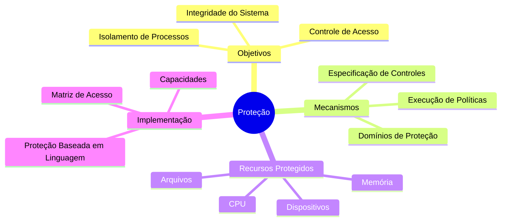
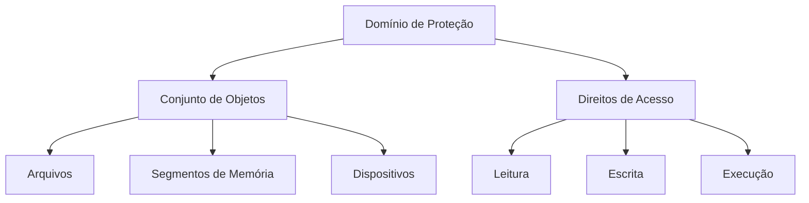

# Proteção em Sistemas Operacionais

## Visão Geral

## Conceitos Fundamentais

### Definição
A proteção é um mecanismo que controla o acesso de programas, processos ou usuários aos recursos do sistema computacional, através de:
- Especificação de controles
- Meios de execução
- Políticas de acesso

### Diferença entre Proteção e Segurança

| Aspecto | Proteção | Segurança |
|---------|----------|-----------|
| Foco | Controle de acesso interno | Defesa contra ameaças externas |
| Escopo | Recursos do sistema | Sistema como um todo |
| Objetivo | Isolamento e controle | Integridade e confiabilidade |
| Mecanismos | Matriz de acesso, capacidades | Criptografia, autenticação |

## Objetivos Principais

### 1. Isolamento de Processos
- Prevenir interferência entre processos
- Garantir execução independente
- Proteger recursos alocados

### 2. Controle de Acesso
- Definir permissões
- Verificar autorizações
- Implementar restrições

### 3. Integridade do Sistema
- Manter consistência
- Prevenir corrupção
- Garantir funcionamento correto

## Domínios de Proteção

## Matriz de Acesso

Exemplo de matriz de acesso:

| Processo | Arquivo1 | Arquivo2 | Impressora |
|----------|----------|----------|------------|
| P1 | Ler, Escrever | Ler | - |
| P2 | Ler | Ler, Escrever | Imprimir |
| P3 | - | Ler | Imprimir |

## Sistemas Baseados em Capacidade

### Características
- Tickets de autorização
- Não podem ser forjados
- Transferíveis sob controle

### Vantagens
1. Flexibilidade
2. Mínimo privilégio
3. Revogação de direitos

## Proteção Baseada em Linguagem

### Benefícios
- Verificação em tempo de compilação
- Tipagem forte
- Encapsulamento

### Exemplos
- Java
- Rust
- Ada

## Considerações de Implementação

1. **Granularidade**
   - Nível de processo
   - Nível de usuário
   - Nível de objeto

2. **Performance**
   - Overhead de verificação
   - Caching de decisões
   - Otimizações

3. **Flexibilidade**
   - Políticas configuráveis
   - Extensibilidade
   - Adaptabilidade

## Exercícios Práticos

1. **Análise de Matriz de Acesso**
   - Identifique possíveis violações
   - Proponha melhorias
   - Implemente verificações

2. **Implementação de Capacidades**
   - Crie sistema simples
   - Teste revogação
   - Avalie segurança

## Resumo

- Proteção é fundamental para sistemas multiusuário
- Diferentes mecanismos atendem diferentes necessidades
- Balance entre segurança e usabilidade
- Implementação requer cuidado e planejamento